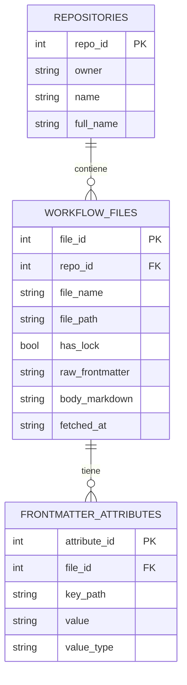

# Diagrama entidad-relación

El dataset generado por `miner extract` está compuesto por **3 tablas**
relacionadas. GitHub renderiza automáticamente el diagrama Mermaid de abajo
al ver este archivo en el repositorio.

## Cardinalidades

| Relación | Cardinalidad | Significado |
|---|---|---|
| `repositories` → `workflow_files` | 1 : N (0 o más) | Un repositorio puede tener uno o varios archivos `.md` de GH-AW; cada archivo pertenece a exactamente un repositorio. |
| `workflow_files` → `frontmatter_attributes` | 1 : N (0 o más) | Un archivo de workflow puede tener uno o varios atributos de frontmatter (o ninguno, si el frontmatter estaba vacío o no se pudo interpretar); cada atributo pertenece a exactamente un archivo. |

## Por qué `frontmatter_attributes` es una tabla clave-valor (EAV)

El frontmatter YAML de GH-AW no tiene un esquema fijo: campos como `on`,
`permissions`, `tools`, `engine`, `timeout-minutes`, etc. varían bastante
entre workflows, y varios de ellos admiten estructuras anidadas (por
ejemplo `on.schedule` es una lista de objetos con un campo `cron` cada uno).

Modelar esto con columnas fijas o con una tabla por campo (como se hizo en
un borrador anterior de este proyecto, con tablas separadas para triggers,
herramientas y permisos) se rompe apenas aparece un workflow con una
estructura distinta a la esperada, o un campo nuevo de la especificación.

En cambio, `frontmatter_attributes` aplana **cualquier** estructura YAML
anidada a pares `(key_path, value, value_type)`, usando dot-notation para
claves de diccionario y `[i]` para posiciones de lista:

| Frontmatter YAML | Filas resultantes en `frontmatter_attributes` |
|---|---|
| `permissions: {contents: read}` | `key_path="permissions.contents"`, `value="read"` |
| `on: {schedule: [{cron: "0 9 * * 1"}]}` | `key_path="on.schedule[0].cron"`, `value="0 9 * * 1"` |

El frontmatter completo también se conserva sin pérdida como JSON en
`workflow_files.raw_frontmatter`, así que cualquier campo puede
reconstruirse o post-procesarse aunque no se haya analizado explícitamente.

Ver [`data-dictionary.md`](data-dictionary.md) para el detalle columna por
columna.
