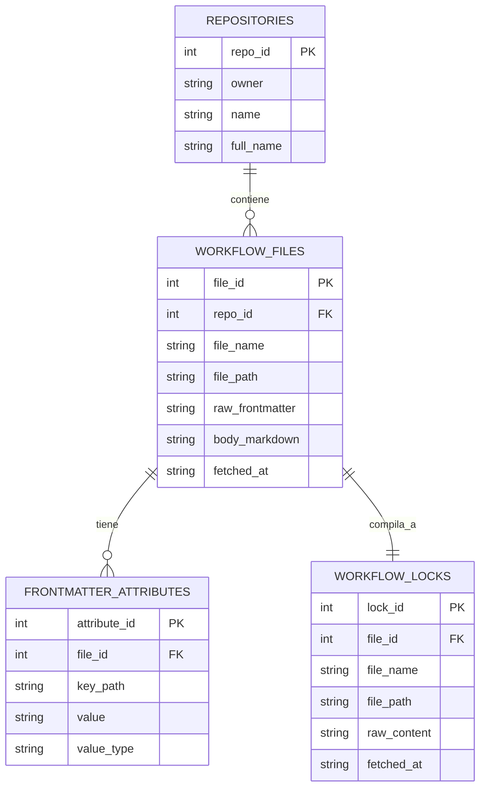

# Diagrama entidad-relación

El dataset generado por `miner extract` está compuesto por **4 tablas**
relacionadas. GitHub renderiza automáticamente el diagrama Mermaid de abajo
al ver este archivo en el repositorio.

## Cardinalidades

| Relación | Cardinalidad | Significado |
|---|---|---|
| `repositories` → `workflow_files` | 1 : N (0 o más) | Un repositorio puede tener uno o varios archivos `.md` de GH-AW; cada archivo pertenece a exactamente un repositorio. |
| `workflow_files` → `workflow_locks` | 1 : 1 (exactamente uno) | Cada archivo `.md` tiene exactamente un `.lock.yml`/`.lock.yaml` compilado — es la definición de "usa GH-AW" de este proyecto (ver `detector.matching_file_pairs`), y `extraction.py` solo registra el par como resuelto si **ambos** archivos se descargaron con éxito. |
| `workflow_files` → `frontmatter_attributes` | 1 : N (0 o más) | Un archivo de workflow puede tener uno o varios atributos de frontmatter (o ninguno, si el frontmatter estaba vacío o no se pudo interpretar); cada atributo pertenece a exactamente un archivo. |

## Por qué `workflow_locks` es una tabla aparte (y no aplanada)

El `.lock.yml` es el workflow **compilado**: YAML de GitHub Actions
generado a partir del `.md` fuente, sin la variabilidad de esquema del
frontmatter (no hay campos "opcionales" que aparezcan o no de workflow en
workflow de la misma forma). Por eso se modela distinto de
`frontmatter_attributes`:

- **Tabla propia** (no una columna extra en `workflow_files`): son dos
  archivos físicos independientes en el repo de origen, con su propio
  nombre, ruta y momento de descarga — modelarlos como dos entidades 1:1
  es más fiel al dominio, y deja lugar para metadatos propios del `.lock`
  a futuro sin tocar `workflow_files`.
- **Contenido como texto plano** (`raw_content`), no aplanado a EAV: a
  diferencia del frontmatter, el `.lock.yml` es contenido generado/
  compilado — aplanarlo en pares clave-valor no aportaría una unidad de
  análisis útil (son cientos de líneas de definición de jobs de GitHub
  Actions), solo ruido.

## Por qué `frontmatter_attributes` es una tabla clave-valor (EAV)

El frontmatter YAML de GH-AW no tiene un esquema fijo: campos como `on`,
`permissions`, `tools`, `engine`, `timeout-minutes`, etc. varían bastante
entre workflows, y varios de ellos admiten estructuras anidadas (por
ejemplo `on.schedule` es una lista de objetos con un campo `cron` cada uno).

Modelar esto con columnas fijas o con una tabla por campo (como se hizo en
un borrador anterior de este proyecto, con tablas separadas para triggers,
herramientas y permisos) se rompe apenas aparece un workflow con una
estructura distinta a la esperada, o un campo nuevo de la especificación.

En cambio, `frontmatter_attributes` aplana **cualquier** estructura YAML
anidada a pares `(key_path, value, value_type)`, usando dot-notation para
claves de diccionario y `[i]` para posiciones de lista:

| Frontmatter YAML | Filas resultantes en `frontmatter_attributes` |
|---|---|
| `permissions: {contents: read}` | `key_path="permissions.contents"`, `value="read"` |
| `on: {schedule: [{cron: "0 9 * * 1"}]}` | `key_path="on.schedule[0].cron"`, `value="0 9 * * 1"` |

El frontmatter completo también se conserva sin pérdida como JSON en
`workflow_files.raw_frontmatter`, así que cualquier campo puede
reconstruirse o post-procesarse aunque no se haya analizado explícitamente.

Ver [`data-dictionary.md`](data-dictionary.md) para el detalle columna por
columna.
